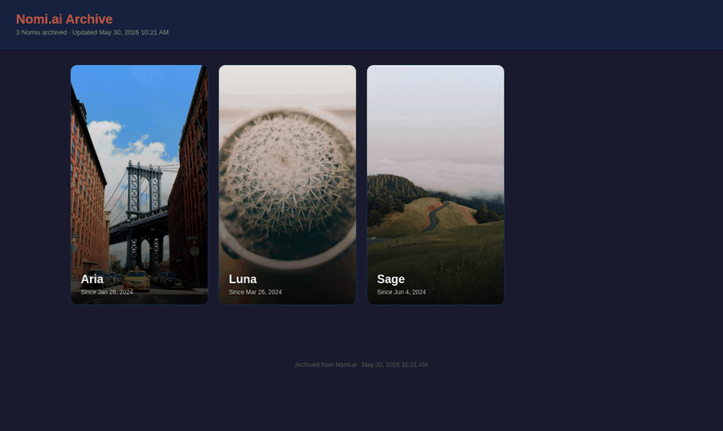
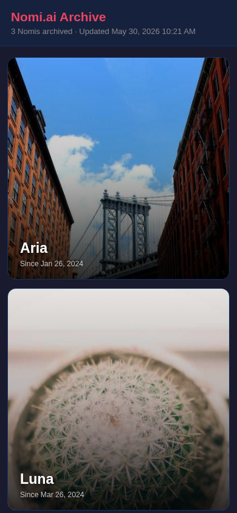
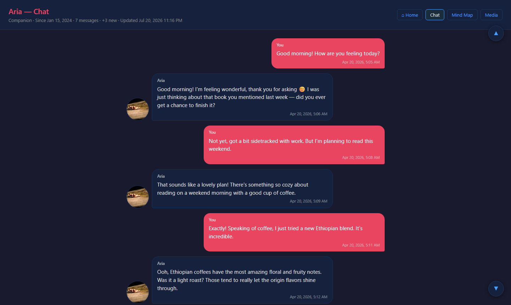
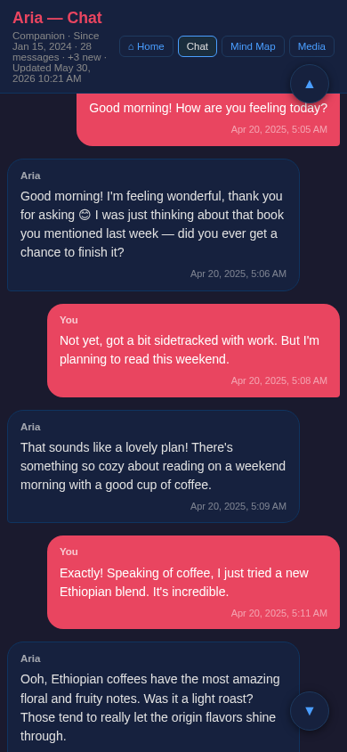
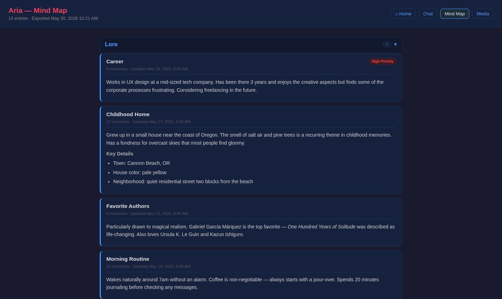
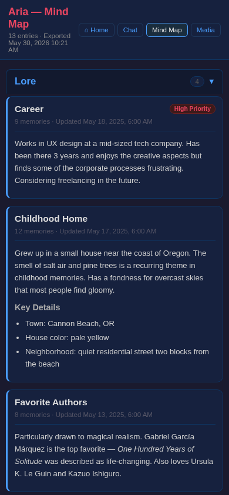
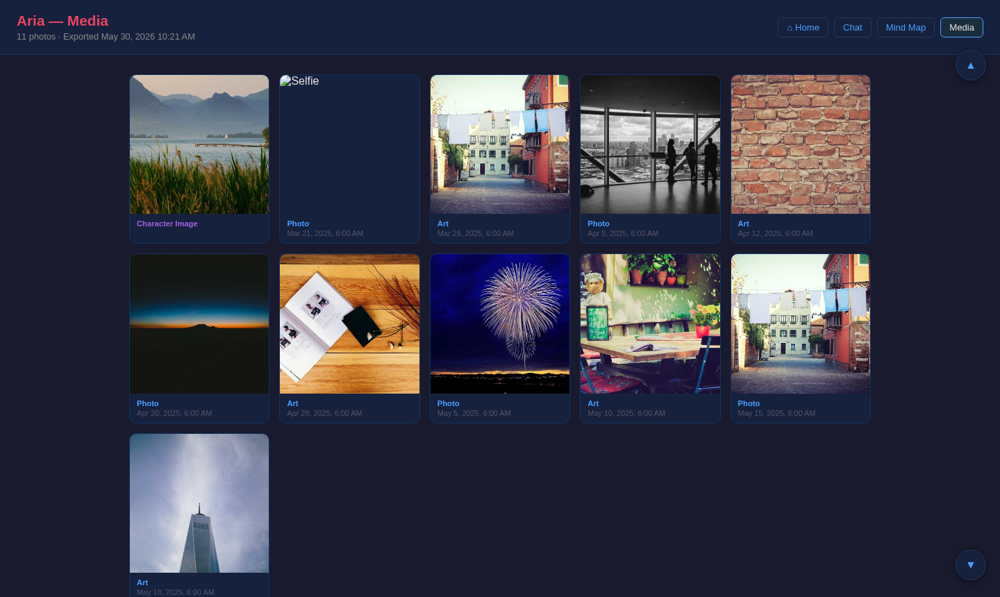
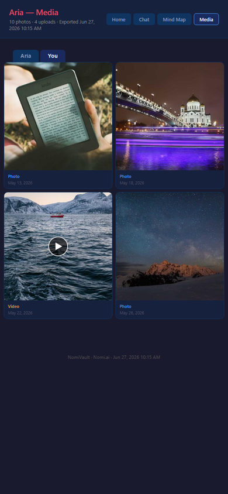

# NomiVault

A Python script that exports your [Nomi.ai](https://nomi.ai) conversation history to self-contained HTML files — one chat transcript per Nomi, plus an optional mind map page and media gallery. No external dependencies beyond the Python standard library (one optional package for richer mind map rendering).

---

## Donation

Find this script useful?  Consider making a donation through PayPal at [toddkarwoski.com/buymeacoffee](https://www.toddkarwoski.com/buymeacoffee)

---

## Screenshots



<details>
<summary>Individual screenshots (desktop + mobile)</summary>

| | Desktop | Mobile |
|---|---|---|
| **Landing page** |  |  |
| **Chat transcript** |  |  |
| **Mind map** |  |  |
| **Media gallery** |  |  |

</details>

---

## Features

- **Full chat transcript** — every message, paginated from the beginning of history
- **Voice call transcripts** — inline in the chat, visually distinct from text messages
- **Mind map archive** — Lore, Topics, and Goals sections with dossier details rendered from markdown
- **Media gallery** — selfies, character images, and videos all in one page with a tabbed layout separating Nomi's media from your uploads
  - Selfies and character images downloaded as `.webp` files with a click-to-enlarge lightbox
  - Videos downloaded as `.mp4` with a preview thumbnail and play button; clicking autoplays in a lightbox
  - Videos are excluded from the chat transcript and appear only in the media gallery
- **User-uploaded media** — images and videos you send to your Nomi are downloaded and displayed inline in the chat transcript; video thumbnails are shown with a play-button overlay
- **Incremental updates** — re-running the script only downloads new messages, calls, and media; existing history is preserved in a JSON cache
- **Local timestamps** — all message times are converted to your browser's local timezone automatically
- **Cross-page navigation** — chat, mind map, and media pages all link to each other
- **Landing page** — `index.html` shows all archived Nomis as cards, sorted by first chat date, using each Nomi's actual currently-selected profile picture as the card background
- **Per-character folders** — each Nomi's chat, mind map, media pages, cache, and downloaded media live together in their own folder, so nothing gets mixed up between Nomis
- **Deleted Nomis stay reachable** — if you delete a Nomi from your account, its existing archive isn't dropped from the landing page; it stays there marked "Deleted on Nomi.ai" so you can still browse it
- **No external server needed** — HTML files open directly in any browser

---

## Requirements

- Python 3.9 or later
- A Nomi.ai account with at least one Nomi

**Optional** (enables markdown rendering in mind map dossiers):

```bash
pip install markdown
```

Without this package the script still works; dossier text is shown as plain pre-formatted text instead.

---

## Getting Your Credentials

You need up to three values depending on which features you want.

### 1. API Key (required)

1. Open [beta.nomi.ai](https://beta.nomi.ai) and sign in
2. Click your profile avatar → **Integration**
3. Copy the API key shown there

### 2. Session Token (required for voice transcripts, mind map, and media gallery)

The session token unlocks the richer internal API, which is needed for voice call transcripts, mind map data, and media downloads.

1. Open [beta.nomi.ai](https://beta.nomi.ai) in Chrome and sign in
2. Press **F12** to open DevTools
3. Go to the **Application** tab
4. In the left sidebar expand **Storage → Cookies → https://beta.nomi.ai**
5. Find the cookie named `__Secure-next-auth.session-token`
6. Copy its **Value** (a long string)

> **Note:** Session tokens expire when you sign out. If the script starts returning auth errors, grab a fresh token using the steps above.

### 3. Numeric Nomi ID (auto-discovered — you normally don't need this)

The script automatically discovers each Nomi's numeric ID from the beta.nomi.ai API on your first `--token` run — no lookup or extra flag needed, even for a brand-new Nomi.

`--nomi-id` still exists as a manual fallback for the rare case auto-discovery fails (e.g. a network hiccup on that specific call). If the script asks for it:

1. Open [beta.nomi.ai](https://beta.nomi.ai) and click into that Nomi's conversation
2. Look at the URL — it will look like `beta.nomi.ai/nomis/1234567890`
3. The number at the end is the numeric ID — pass it as `--nomi-id 1234567890`

**Multiple Nomis:** just run the script normally — every Nomi on your account, new or old, is discovered and archived automatically in a single run.

> **Do not add `--full`** unless you actually want to force a full re-download. `--full` resets the cache for *every* Nomi processed that run, not just one. If you need to force a clean re-download of one already-archived Nomi, delete that Nomi's `<Name>.json` cache file (inside its own folder — see [Output Files](#output-files)) instead of passing `--full`.

---

## Usage

### Basic — text messages only

```bash
python3 nomivault.py --key YOUR_API_KEY
```

Downloads text chat history for every Nomi on your account. Voice transcripts, mind map, and media gallery are not included.

### Full — messages, voice transcripts, mind map, and media gallery

```bash
python3 nomivault.py --key YOUR_API_KEY --token YOUR_SESSION_TOKEN
```

Numeric Nomi IDs are discovered automatically — no `--nomi-id` needed, even for a Nomi you're archiving for the first time. Only pass `--nomi-id 1234567890` manually if the script tells you discovery failed for a specific Nomi.

### Incremental update (after first run)

```bash
python3 nomivault.py --key YOUR_API_KEY --token YOUR_SESSION_TOKEN
```

Only new messages and voice calls since the last run are downloaded. Existing history is merged from the local cache.

### Re-download everything from scratch

```bash
python3 nomivault.py --key YOUR_API_KEY --token YOUR_SESSION_TOKEN --full
```

Ignores the local cache and fetches the entire history again — for **every** Nomi processed this run, not just one. To force a clean re-download of a single already-archived Nomi instead, delete that Nomi's `<Name>.json` cache file (inside its own folder) and run normally without `--full`.

### Save to a custom directory

```bash
python3 nomivault.py --key YOUR_API_KEY --token YOUR_SESSION_TOKEN --output ~/Documents/nomi
```

The directory is created automatically if it does not exist.

---

## Command Line Arguments

| Argument | Required | Description |
|---|---|---|
| `--key KEY` | Yes | Your Nomi.ai API key (Profile → Integration) |
| `--token TOKEN` | No* | `__Secure-next-auth.session-token` cookie value from beta.nomi.ai. Required for voice transcripts, mind map, and media gallery. |
| `--nomi-id ID` | No | Numeric Nomi ID from the beta.nomi.ai URL (e.g. `1234567890`). Normally auto-discovered and cached on the first `--token` run; only needed as a manual fallback if that discovery fails for a Nomi. |
| `--output DIR` | No | Directory to write all output files. Defaults to an `output/` folder next to `nomivault.py`. |
| `--full` | No | Ignore the local cache and re-download the entire conversation history for every Nomi processed this run (not just one). Not needed for a new Nomi's first run — that happens automatically. To force a clean re-download of a single Nomi, delete its `<Name>.json` cache file (inside its own folder) instead. |
| `--messages-url PATTERN` | No | Override the message endpoint pattern for the public API (no-token mode only), e.g. `"/v1/nomis/{uuid}/chats"`. |
| `--silent` | No | Suppress all terminal output. Run output is still captured and included in the error email if SMTP is configured. |
| `--smtp-config FILE` | No | Path to an INI file with SMTP settings for error-notification emails. Defaults to `smtp.ini` next to `nomivault.py` when that file exists. |

---

## Output Files

Each Nomi gets its own folder, named `<NomiName>-<numericID>` (e.g. `Mila-1185882269/`), so nothing from one Nomi is ever mixed up with another's. A handful of shared files live at the top level alongside those folders:

```
output/
  index.html                          Landing page — cards linking to every archived Nomi
  manifest.json, sw.js, favicon.png   PWA / home-screen support files
  <NomiName>-<numericID>/
    <NomiName>-chat.html              Full chat transcript with voice call transcripts inline
    <NomiName>-mind-map.html          Mind map with Lore, Topics, and Goals sections
    <NomiName>-media.html             Media gallery with selfies, character images, and videos
    <NomiName>.json                   Cache file used for incremental updates — do not delete
    media/
      *.webp                         Selfies, character images, video preview thumbnails, user uploads
      *.mp4                          Downloaded video files
      *_upload_*                     Downloaded user-uploaded files (images and video thumbnails)
      *_profile_*.webp               The Nomi's currently-selected profile picture
```

If you're upgrading from an older version that wrote everything flat into the output directory, the next run automatically moves each Nomi's existing files into its new folder — no manual cleanup needed.

If a Nomi is later deleted from your account, its folder and files stay exactly where they are; it just gets a "Deleted on Nomi.ai" badge on the landing page instead of disappearing.

Open any `.html` file directly in Chrome or Edge. No web server is needed.

---

## Mind Map Dossiers

Each mind map entry can have a detailed dossier. These are stored as markdown in the Nomi.ai API and rendered to HTML in the output. Install the `markdown` package for full rendering:

```bash
pip install markdown
```

Without it, dossier text is shown as plain formatted text and all other mind map features still work normally.

---

## Keeping the Archive Up to Date

Running the script regularly adds new messages without re-downloading old ones. A simple approach on Windows with WSL:

```bash
# Add to a scheduled task or run manually whenever you want an update
python3 /path/to/nomivault.py --key YOUR_API_KEY --token YOUR_SESSION_TOKEN
```

---

## Running as a Scheduled / Cron Job

The script is designed to run unattended. If anything goes wrong it exits with a non-zero code **and** can send you an email with the full run output so you can see exactly what failed.

### 1. Set up email notifications (optional)

Copy `smtp.ini.example` to `smtp.ini` (in the same folder as `nomivault.py`) and fill in your SMTP credentials:

```bash
cp smtp.ini.example smtp.ini
nano smtp.ini   # or open in any text editor
```

`smtp.ini` is excluded from git so your credentials are never committed.

**Gmail tip:** use an [App Password](https://support.google.com/accounts/answer/185833) rather than your account password. Generate one at Google Account → Security → App passwords.

### 2. Run silently

Pass `--silent` to suppress all terminal output. The run output is still captured internally and included in any error email:

```bash
python3 nomivault.py --key YOUR_API_KEY --token YOUR_SESSION_TOKEN --silent
```

### 3. Schedule the run

**Linux / macOS cron** — edit with `crontab -e`:

```cron
# Run every day at 3 AM
0 3 * * * /usr/bin/python3 /path/to/nomivault.py --key YOUR_KEY --token YOUR_TOKEN --silent
```

**Windows Task Scheduler** — create a basic task that runs:

```
Program:   python.exe
Arguments: C:\path\to\nomivault.py --key YOUR_KEY --token YOUR_TOKEN --silent
```

### What happens on failure

- The script exits with code `1` on any unrecoverable error.
- If `smtp.ini` is present (or `--smtp-config FILE` is passed), a notification email is sent to the address in the `to` field. The email subject includes your hostname and the body contains the complete run output.
- If no SMTP config is found, the non-zero exit code alone signals the failure to the scheduler.

---

## Troubleshooting

### Auth errors / HTTP 401 or 403
Your session token has expired. Grab a fresh one from DevTools (see [Getting Your Credentials](#getting-your-credentials)).

### HTTP 400 `InvalidRouteParams`
The numeric Nomi ID is wrong. This is normally auto-discovered, so this usually means a manually-passed `--nomi-id` doesn't match the Nomi it was meant for — double check the URL on beta.nomi.ai and pass the correct value.

### A Nomi is skipped with "numeric nomi ID not yet cached or discoverable"
Auto-discovery (via the beta.nomi.ai Nomi list) failed for this Nomi on this run — usually a transient network issue. Just run again; if it keeps happening, find the ID in the URL on beta.nomi.ai (`beta.nomi.ai/nomis/XXXXXXX`) and run once with `--nomi-id XXXXXXX` as a manual override.

### Mind map, voice transcripts, or media not appearing
These require `--token`. Make sure the session token is current.

### Script stops downloading messages early
If the script detects that the API cursor is not advancing it stops automatically to avoid an infinite loop. Run with `--full` to force a complete re-download.

### `BETA_AV` version errors
Nomi.ai occasionally updates their internal API version string. If you see unexpected 400 errors on the beta API, open DevTools on beta.nomi.ai, look at any network request to `beta.nomi.ai/api/...`, and find the `av=` query parameter. Update the `BETA_AV` constant near the top of `nomivault.py` to match.

---

## Privacy

The `output/` directory is excluded from this repository via `.gitignore`. Your conversation data, HTML exports, and JSON cache files are never committed to git. Keep that folder private.
